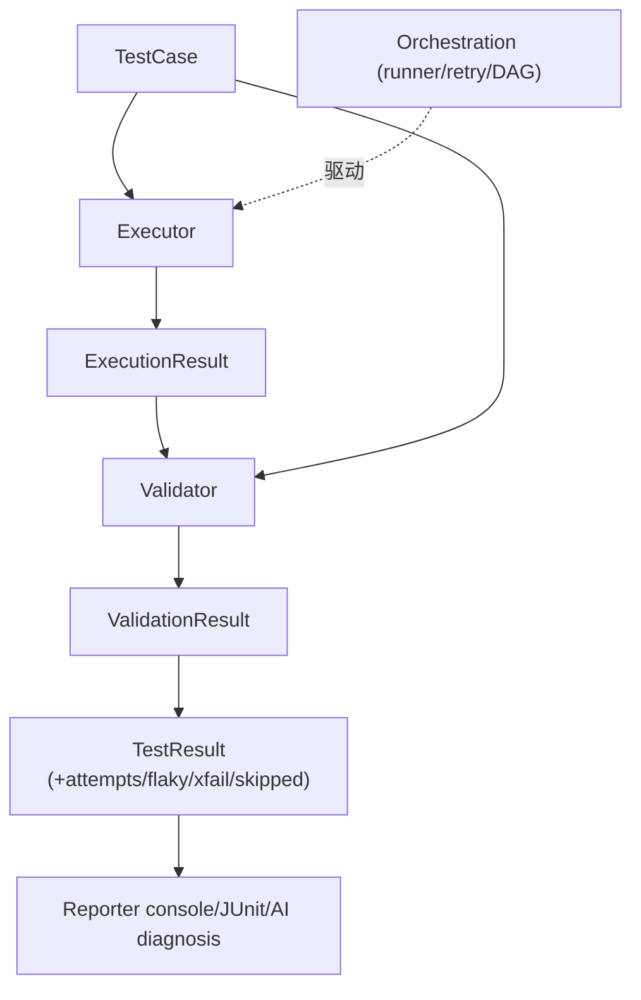

# Symtest 1.4 开发计划 — Core Model Refactoring

> 状态：Phase 0 已完成（2026-08-27）；Phase 1 已完成（2026-08-31）；Phase 2 已完成（2026-08-31）
> 版本：1.4
> 分支：develop_1.4

## 一、版本定位

1.4 只回答三个问题，重新定义"一条测试从配置到结果"的核心数据模型和生命周期：

1. **TestCase 是什么？** 有哪些组成部分，各自负责什么？
2. **一条 TestCase 怎么执行？** 谁负责 command、step、timeout、env、retry？
3. **执行完之后怎么判断通过？** 谁负责 expected、file compare、baseline、failure classification？

### 明确不做（NOT DO）

以下内容在 1.4 中**只做适配、不重新设计**；新功能一律不做：

- 新 comparator / 新 file format
- 新 scheduler / 新资源管理
- 新 TUI feature
- 新 AI feature
- 新 reporter
- 新 CLI feature
- 性能优化
- packaging 现代化

除非为了 1.4 migration 必须修改。

---

## 二、核心架构宪法

六条不可破坏的依赖规则。后续任何 feature 讨论先对照此宪法归属，再写代码。

> **Phase 0 定稿说明**：本节内容经评审定稿，正式契约已迁入
> docs/design.md §10 与 docs/design_en.md §10（含依赖方向细则与可执行化条款）；
> 本开发阶段文档保留原始推导，两处以正式契约为准。

### 原则 1：TestCase 是声明，不执行任何事情

`TestCase = specification`。

不允许存在 `test_case.run()` / `test_case.validate()` / `test_case.update_baseline()`。
TestCase 只描述：**我要执行什么，以及如何判断结果**。

组成：

```
TestCase
├── metadata    （顶层：name / tags / description / expected_failure / xfail_* ...）
├── execution   （ExecutionSpec）
├── expected    （ExpectationSpec）
└── scheduling  （SchedulingSpec）
```

概念模型分层 ≠ YAML 必须机械映射 class hierarchy。`name/tags/description` 保留顶层，
避免 DSL 啰嗦；真正拆出去的是执行语义、验证语义、调度语义。

### 原则 2：Execution 不知道"通过/失败"

```
Executor: ExecutionSpec ──execute──▶ ExecutionResult
```

ExecutionResult 只包含执行事实：`return_code / stdout / stderr / duration /
timed_out / error / artifacts`。

Executor 不允许知道：`expected_return_code / output_contains / baseline /
rtol / file comparison / xfail / next_action_hint`。
超时只报告 `timed_out=True`，"timeout 是否算失败"由 Validator 判定。

### 原则 3：Validation 不执行被测程序，且永远只读

```
Validator: ExpectationSpec + ExecutionResult ──validate──▶ ValidationResult
```

Validator 不允许 `subprocess.Popen` 被测进程、kill 进程、retry。

**例外条款（受控豁免）**：comparator 是验证的内部工具，`script`
comparator 执行的是"比较工具"而非"被测程序"，属于本条的明确豁免；
1.4 不改变其行为。

**baseline 语义**：Validator 永远只读文件。`--update-baseline` 由 runner
在拿到 ValidationResult 后执行独立的 accept 步骤（复制 actual→baseline）再判定。

### 原则 4：Orchestration 组合，而不实现底层语义

Runner / Scheduler / DAG / ParallelRunner 负责：什么时候执行、执行哪个 case、
顺序、依赖、并发、**retry policy**（一次 attempt =
`Executor.execute → Validator.validate`，runner 拿 verdict 决定是否重跑，
flaky 判定也在编排层）；但不自己实现 subprocess 管理、float 比较、stdout 判断。

### 原则 5：Reporting 只能消费 Result

```
TestResult ──▶ Reporter ──┬── console
                          ├── JSON
                          ├── JUnit
                          └── AI diagnosis
```

`next_action_hint` 属于 result consumer（diagnosis），不得留在 execution 层。

### 原则 6：核心模型不依赖表现层

`core` 绝对不能 import：`cli` / `tui` / `reporter` / AI-specific adapter。

现状的 `parse_test_cases` 存在 "TUI mode" 后门（workspace=None 时放宽校验），
1.4 中拆除：TUI 与 runner 使用同一解析器，宽松形态由 TUI 侧自行处理。

### 宪法可执行化

新增 architecture guard 测试（例如断言 `execution/executor.py` 的 import 图中
不出现 `assertions` / `validation`），由 CI 强制执行，使宪法可回归验证。

---

## 三、TestCase v2 数据模型

统一现状 dataclass（`TestCase`）与 TypedDict（`TestCaseData`）双轨表示，
删除 `to_execution_dict()` 这类桥接转换函数。

v2 DSL 示例（简写形态）：

```yaml
name: beam_test                 # 顶层 metadata
tags: [regression]

execution:                      # ExecutionSpec：单命令简写 或 steps 完整形（二选一）
  command: solver
  args: [model.inp]
  timeout: 3600
  env: {OMP_NUM_THREADS: "4"}   # case 级 env，作用于所有 step（语义不变）
  retry_count: 2

expected:                       # ExpectationSpec（case 级，所有 step 过后评估）
  return_code: 0
  output_contains: ["Analysis completed"]
  compare_files:
    - {actual: result.h5, baseline: baseline/result.h5, type: h5, rtol: 1e-5}

scheduling:                     # SchedulingSpec
  depends_on: [preprocess]
  resources: {cpu_cores: 4}
```

steps 完整形：`execution.steps[]` 中每个 step 是"执行+判定"的原子对，
携带自己的 `command/args/timeout/retry_count/expected`；
step 级重试同样由编排层的 sequence 执行器驱动。

字段迁移映射：

| v1 字段 | 去向 |
|---|---|
| `name` `description` `tags` `expected_failure` `xfail_reason` `xfail_quiet` `abstract` `extends` `variables` `import` | 顶层不变 |
| `command` `args` `timeout` `retry_count` `env` `steps` | → `execution` |
| `expected` | → `expected` |
| `depends_on` `resources` | → `scheduling` |

parser 将简写归一为单元素 steps 列表。单 step 时 step 级与 case 级 expected
语义等价（combined output == step output），迁移等价性成立。

Schema 变更 intentionally breaking（1.4 configuration schema is
intentionally breaking），提供 migrate 命令而不是兼容适配层。
理由：项目尚年轻、真实用户规模有限、长期 compat adapter 是永久技术债。

---

## 四、Execution / Validation 解耦



搬移清单：

| 现状位置 | 问题 | 去向 |
|---|---|---|
| `execution.py::validate_result` | 验证逻辑住在 execution 层 | `validation/validator.py` |
| `execution.py::_build_next_action_hint` | reporting 语义（原则 5） | `reporting/diagnosis.py` |
| `config_loader.py::execute_sequence` | sequence 引擎住在配置解析模块 | `core/orchestration/sequence.py` |
| Executor 内联调用 validate_result 并写 status | 原则 2 | executor 纯净化后由编排层组合 |
| Validator 内 update_baseline 写文件 | 原则 3 | runner 侧独立 accept 步骤 |
| retry 循环在 executor 内部 | 原则 2 | 编排层 retry policy |
| `parse_test_cases` TUI mode 分支 | 原则 6 | 拆除，单一解析器 |

**Phase 2 唯一验收标准**：executor 不知道 expected 的存在（guard 测试强制）。
subprocess 内部实现多丑都不管——1.4 是职责拆分，不是能力扩展。

注意：retry 上移后，`attempt_history` / flaky 聚合逻辑从 execution 搬到
runner，属纯搬迁，行为必须逐位保持；现有 retry/flaky 测试是回归门。

Phase 2 实施备注（2026-08-31）：
- 已知怪癖逐位保持：`--update-baseline` 成功 accept 后
  `result["baseline_updated"]` 保持 `[]`（baseline_updated 只出现在
  assertion_results 的 compare_files 条目里），`results["updated"]` 计数
  不增长、文本报告不显示 "(baseline updated)"。此为 1.3 既有行为，
  本次重构未修复，留待后续版本单独决策。
- `reporting/diagnosis.py` 是 core→reporting 的唯一 import 点
  （orchestration 调用它填充 wire format 的 `next_action_hint`），
  guard 测试将其登记为登记在册的例外；严格分层（hint 完全移出结果
  dict、由 reporter 侧生成）留待后续版本。
- `execute_single_test_case` 兼容旧 dict 形态（sequence 引擎、
  process_worker 仍传 dict），Phase 3 Schema v2 落地后移除。

---

## 五、目标模块布局

```
src/symtest/
├── core/
│   ├── test_case.py          # TestCase v2 分层模型
│   ├── execution/
│   │   ├── executor.py       # 纯 subprocess → ExecutionResult（无 assertions import）
│   │   └── result.py         # ExecutionResult
│   ├── validation/
│   │   ├── validator.py      # ExpectationSpec + ExecutionResult → ValidationResult
│   │   ├── assertions.py     # 从 core/ 迁入
│   │   └── result.py         # ValidationResult
│   ├── orchestration/
│   │   ├── base_runner.py    # 组合层 + retry policy + accept-baseline 步骤
│   │   ├── sequence.py       # execute_sequence（自 config_loader 迁入）
│   │   └── parallel_runner.py
│   └── result.py             # TestResult = Execution + Validation + 编排元数据
├── reporting/
│   └── diagnosis.py          # next_action_hint（result consumer）
├── file_comparator/          # 不动（Validator 的工具）
├── config/                   # schema v2 + parser + migrate
├── tui/                      # 适配新 core model，不重新设计
└── cli.py                    # 同上
```

依赖方向：`execution` 与 `validation` 互不 import；orchestration 可 import
两者；reporting 只 import result 类型；core 不 import cli/tui/reporter。

---

## 六、实施阶段

全程保持现有 regression suite 全绿（`python tests\run_all.py`）。

| Phase | 内容 | 验收标准 |
|---|---|---|
| 0 | 本设计文档评审定稿 | ✅ 已完成（2026-08-27）：宪法合入 design.md / design_en.md §10 |
| 1 | TestCase v2 数据模型 + ExecutionResult/ValidationResult/TestResult 类型 | ✅ 已完成（2026-08-31）：test_model_v2.py 22 用例；全量回归绿 |
| 2 | execution/validation 解耦（hint 搬家、sequence 搬家、accept 步骤、retry 上移） | ✅ 已完成（2026-08-31）：executor 无 assertions/validation import（guard 测试强制）；全量回归绿（862 passed） |
| 3 | Schema v2 + parser + 三处同步（config_schema / parse_test_cases / config_io.validate_config）+ runner 适配（sequential/parallel/DAG/resume/steps 仅改取值路径） | ✅ 已完成（2026-09-02）：v2 分层 DSL 切换 + Phase 2 dict shim 全部移除（含 process 模式改用 `case.to_dict()`，顺带修复 env 不跨进程）；fixtures/测试语料/user_manual 同步 v2，v1 原件留存于 tests/fixtures/migration/v1/ 供 Phase 4 等价性测试；全量回归绿 |
| 4 | `symtest migrate` + 迁移等价性测试 + AI Skill | ✅ 已完成（2026-09-02）：`symtest migrate` 子命令（config/migrate.py 纯函数 + commands/migrate.py，幂等、保留 import/setup）；A==B 等价性不变量测试（tests/unit/test_migrate.py，语料 = tests/fixtures/migration/v1/* 含 examples/skill 模板拷贝）；AI Skill 双轨——examples/skill 更新至 v2，迁移复查独立成新 skill examples/skill-migration；全量回归绿 |

### 迁移设计（Phase 4）

第一层：确定性转换命令

```
symtest migrate old.json [--output new.json]
```

负责可机械转换部分：command/args/env/timeout/steps → `execution`；
expected → `expected`；depends_on/resources → `scheduling`。

第二层：AI Skill，检查迁移后的项目特有配置、自定义 comparator、复杂
inheritance、workspace 插件等需要人工判断的部分。

推荐流程：

```
old config → symtest migrate → new schema → symtest validate → skill 复查
```

**迁移验收不变量**（比 YAML 文本 diff 更强）：

```
legacy config ──legacy parser──▶ Normalized A
legacy config ──migrate──▶ new config ──new parser──▶ Normalized B
                                     断言：A == B
```

fixtures 取 tests/ 与 examples/ 下全部存量配置文件。

---

## 七、成功判据

重构完成后，任意新 feature 应能立刻回答归属：

| 提问 | 归属 |
|---|---|
| 增加 GPU resource requirement？ | SchedulingSpec |
| 增加 stderr regex assertion？ | ExpectationSpec / Validator |
| 支持 Docker command execution？ | Executor |
| AI 告诉我下一步该干嘛？ | Result consumer / diagnosis |

若仍经常出现"这个功能到底放 execution、runner 还是 testcase？"的争论，
说明宪法没有真正解决问题。
